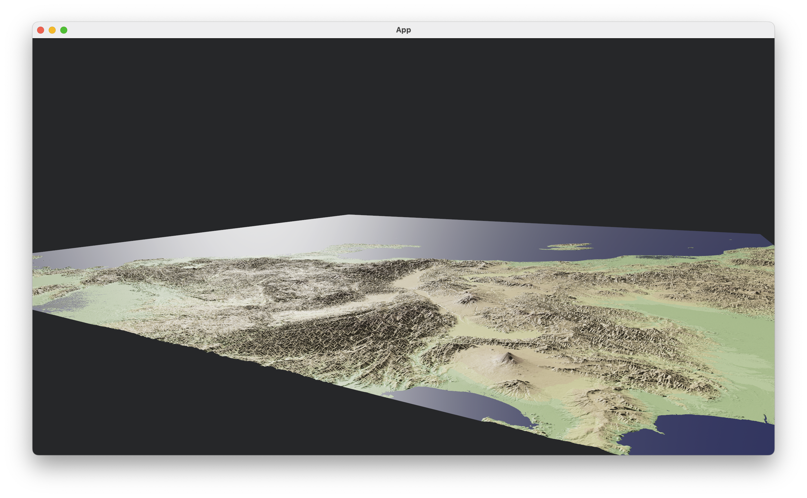

# Visualize SRTM data with Bevy
Simple (not yet accurate) mapping of SRTM data to a Plane3d mesh in bevy.

### SRTM data source
Jarvis A., H.I. Reuter, A.  Nelson, E. Guevara, 2008, Hole-filled  seamless SRTM
data V4, International  Centre for Tropical  Agriculture (CIAT), available  from
http://srtm.csi.cgiar.org

REFERENCES

Reuter  H.I,  A.  Nelson,  A.  Jarvis,  2007,  An  evaluation  of  void  filling
interpolation  methods  for  SRTM  data,  International  Journal  of  Geographic
Information Science, 21:9, 983-1008.